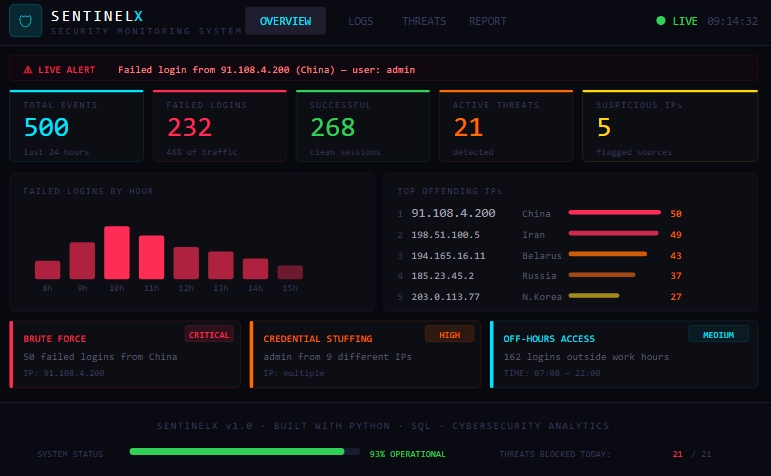

# 🛡️ SentinelX — Security Monitoring & Threat Detection Dashboard

> A mini cyber defense system that simulates a real company's SOC (Security Operations Center) setup.


---

## 📸 Dashboard Preview



---

## 🧠 What is SentinelX?

SentinelX is a cybersecurity data analytics project that:
- Generates realistic login/network logs
- Detects suspicious activity automatically
- Stores everything in a SQL database
- Produces a professional threat intelligence report
- Displays everything in a live web dashboard

---

## ⚙️ Tech Stack

| Tool | Purpose |
|------|---------|
| Python | Data processing & detection engine |
| Pandas | Log analysis & preprocessing |
| SQLite | Database storage |
| Faker | Realistic log generation |
| Colorama | Terminal threat alerts |
| Flask | Live web dashboard |
| Chart.js | Interactive charts |

---

## 📂 Project Structure

## 📂 Project Structure

## 📂 Project Structure

```text
SentinelX-Security-Dashboard/
│
├── data/
│   ├── raw_logs.csv
│   ├── processed_logs.csv
│   └── threats.csv
│
├── database/
│   ├── schema.sql
│   └── queries.sql
│
├── images/
│   └── sentinelx_dashboard.png
│
├── reports/
│   └── threat_report.md
│
├── scripts/
│   ├── config.py
│   ├── generate_logs.py
│   ├── preprocess.py
│   ├── detect_threats.py
│   └── load_database.py
│
├── templates/
│   └── dashboard.html
│
├── app.py
├── pipeline.py
├── README.md
└── requirements.txt
```

---

---

## 🚀 How to Run

**1. Clone the repository**

git clone https://github.com/retaj7-bot/SentinelX-Security-Dashboard.git
cd SentinelX-Security-Dashboard

**2. Install dependencies**

pip install -r requirements.txt

**3. Run everything in one command**

py pipeline.py

**4. Launch the live dashboard**

py app.py

**5. Open your browser and go to**

http://127.0.0.1:5000

---

## 🚨 Threats Detected

| Type | Severity | Description |
|------|----------|-------------|
| Brute Force | CRITICAL | 50+ failed logins from single IPs |
| Privileged Account Attack | CRITICAL | 101 attempts on admin/root |
| Geo Anomaly | HIGH | Attacks from Russia, China, Iran |
| Credential Stuffing | HIGH | Users accessed from 9+ different IPs |
| Off-Hours Access | MEDIUM | 162 logins outside business hours |

---

## 💡 Key Features

- Brute force detection — flags IPs with 5+ failed attempts
- Geo-based risk analysis — identifies high-risk countries
- Credential stuffing detection — catches multi-IP user access
- Off-hours monitoring — flags suspicious time-based activity
- SQL database — all data stored and queryable
- Live web dashboard — real charts and live log viewer
- Threat report — auto-generated analyst-style report
- One command pipeline — runs entire system automatically

---

## 👤 Author

Built by Retaj Rabie as a cybersecurity portfolio project.
Combines: Cybersecurity · Data Analytics · Python · SQL · Flask

---

This project simulates a real SOC environment for educational and portfolio purposes.